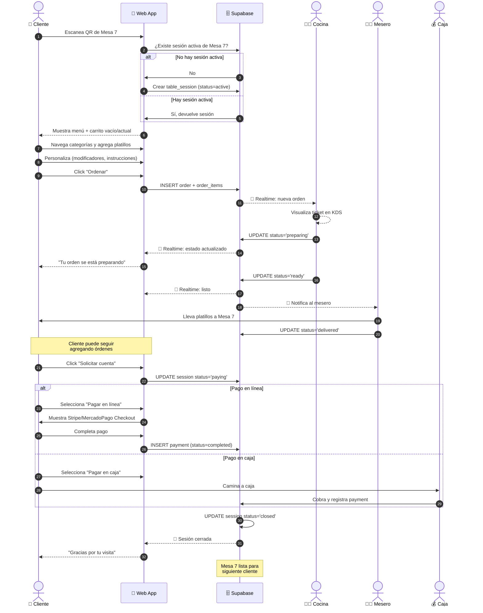
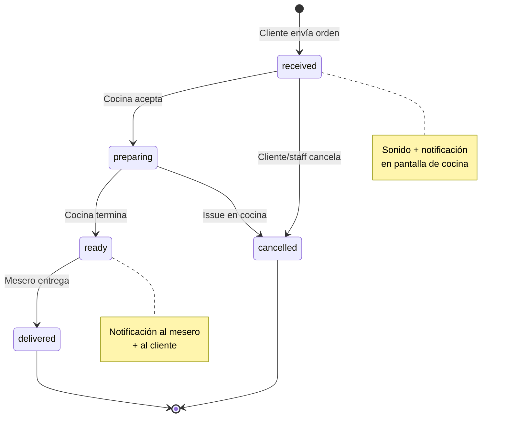
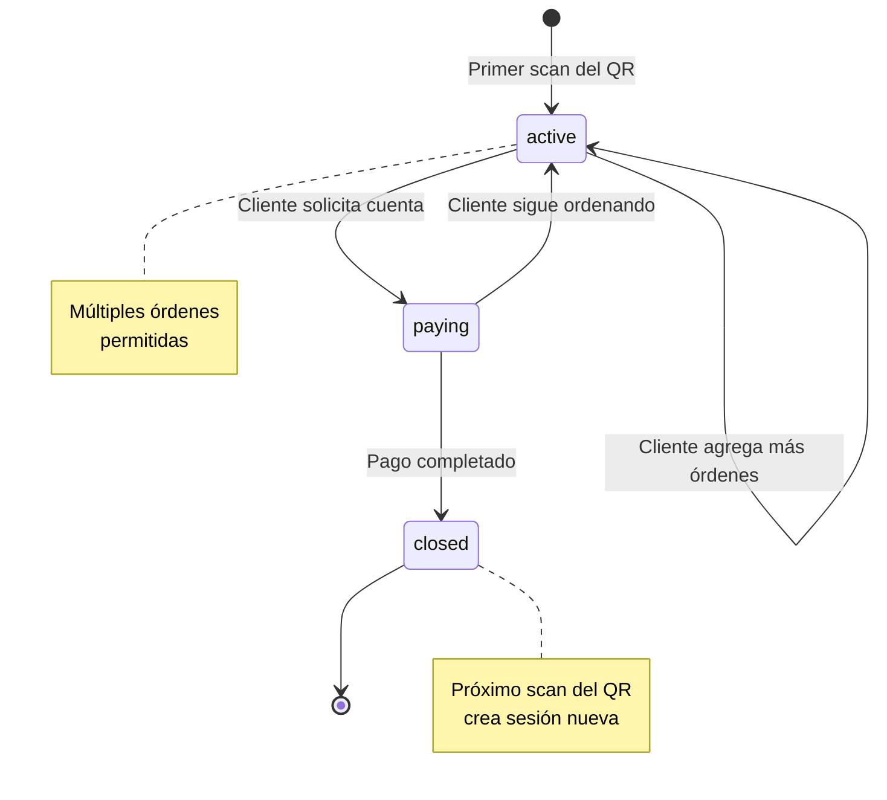
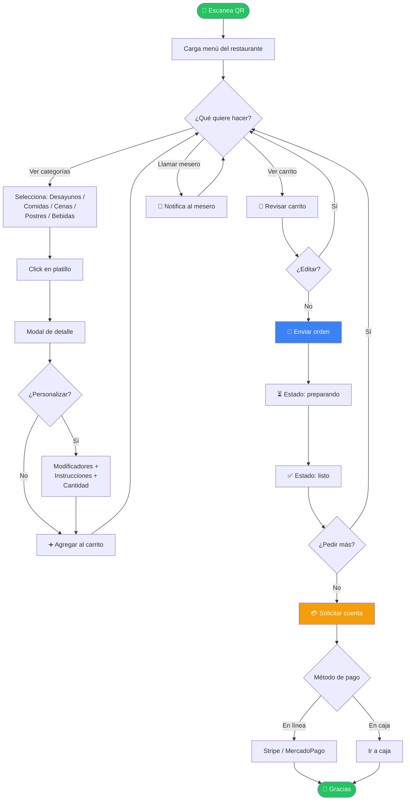
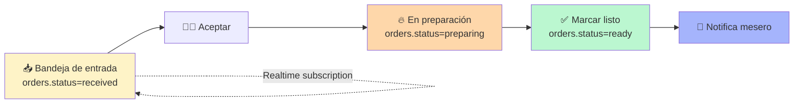
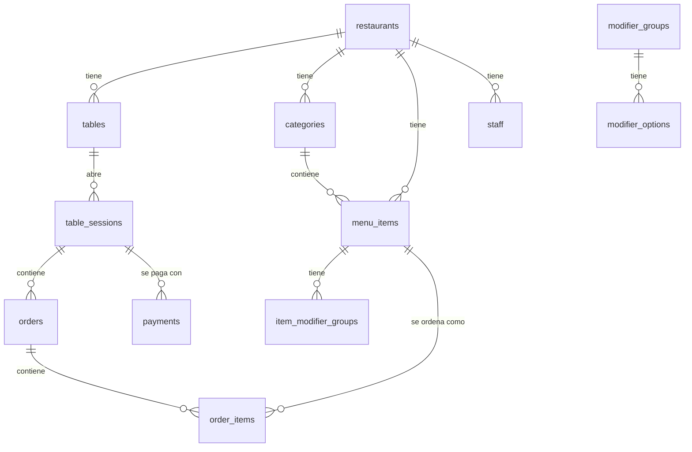

# 🔀 Diagramas de Flujo — Menú Digital QR

> Diagramas en formato Mermaid. Se renderizan automáticamente en Claude Code, VS Code (extensión Markdown Preview Mermaid), GitHub y la mayoría de visores de markdown.

---

## 1️⃣ Flujo Principal (Happy Path) — Cliente, Cocina, Caja



---

## 2️⃣ Estados de una Orden



---

## 3️⃣ Estados de una Sesión de Mesa



---

## 4️⃣ Vista del Cliente (Flowchart)



---

## 5️⃣ Vista de Cocina (KDS)



---

## 6️⃣ Arquitectura de Datos (Relaciones Clave)



---

## 7️⃣ Multi-Tenant Routing

```mermaid
flowchart TD
    URL[/m/tacos-don-pepe/mesa-7]
    URL --> MW{middleware.ts}
    MW --> R[Resuelve restaurant_slug<br/>= tacos-don-pepe]
    MW --> T[Resuelve table_id<br/>= mesa-7]
    
    R --> Q1[(SELECT * FROM restaurants<br/>WHERE slug = ?)]
    T --> Q2[(SELECT * FROM tables<br/>WHERE id = ?)]
    
    Q1 --> V{¿Existe y activo?}
    Q2 --> V
    
    V -->|No| E[404 / Error]
    V -->|Sí| Theme[Aplica branding<br/>colores + logo]
    Theme --> Load[Carga menú filtrado<br/>por restaurant_id]
    Load --> UI[Renderiza app]
```